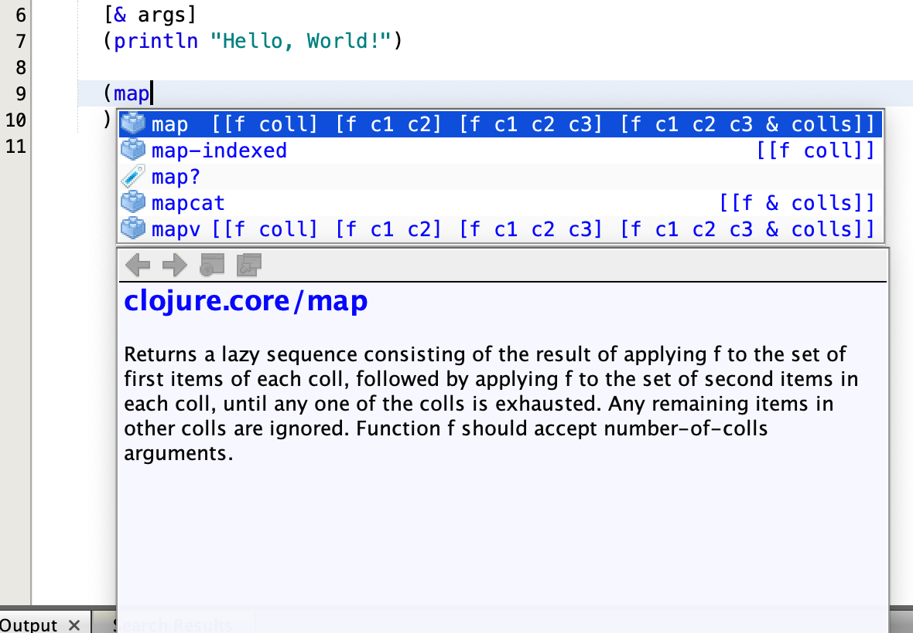
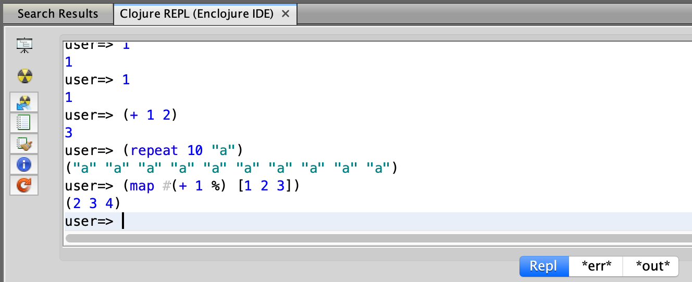

# Clojure plugin for current day [OpenBeans](http://www.openbeans.org) 2019.12 and [NetBeans](http://netbeans.apache.org) 11.2.

This plugin was dormant for years and while many things have been fixed to make
it work on the most recent OpenBeans version, bugs might still exist. Please report
any issues you might find here on GitHub or via Twitter to [Emilian Bold](https://twitter.com/emilianbold).

## History

This project is a fork of Jan Konieczny's project which was a fork of Tim Boudreau's which
was a fork of Eric Thorsen's original Enclojure project. 

## Compilation

Compiles with OpenBeans 2019.12 / NetBeans 11.2 and Java 11.

Requires a rather up-to-date Maven. Maven 3.6.3 is known to work.

### Caveats

There are other issues - the naive approach to integrating a scripting
language into an IDE is to load up user code inside the IDE's VM.  In practice
this has disasterous consequences - user code gets to wreak havoc with the IDE.
This plugin does exactly that, so caveat emptor.

There is some code that assumes other Clojure code that initializes the REPL window will have run before a project or the editor is opened;  in practice windows are
lazy-loaded, so having it open is a good idea.

